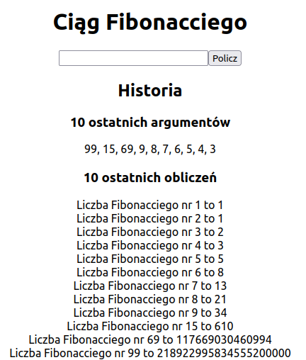

# DockerZad1



Do uruchomienia wystarczy polecenie:
```
docker compose up
```
Wtedy uruchomiony projekt jest [tutaj](http://localhost:3050)

##Co zmieniono
W zadaniu narzucono ograniczenie na wartość podanego argumentu, ponieważ dla większych liczb czas obliczania znacząco się zwiększa. Wcześniejszy algorytm był rekurencyjny, a złożoność obliczeniowa wynosi O(Φ^n^), gdzie Φ oznacza złotą liczbę. Dla porównania złożoność obliczeniowa algorytmu iteracyjnego wynosi O(n). To oznacza, że dla argumentu 100 algorytm iteracyjny będzie **18** *rzędów wielkości szybsza* od algorytmu rekurencyjnego. Zatem jest tak szybki, że można ograniczenie znieść. Szczegóły można znaleźć [tutaj](https://www.baeldung.com/cs/fibonacci-computational-complexity")

W celu wybrania ostatnich 10 indeksów należało zmodyfikować strukturę bazy danych. W tym celu dodano kolumnę *created_at* aby przechować kiedy dodano indeks. Wtedy w zapytaniu select można było sortować wg czasu dodania oraz ograniczyć liczbę rezultatów.